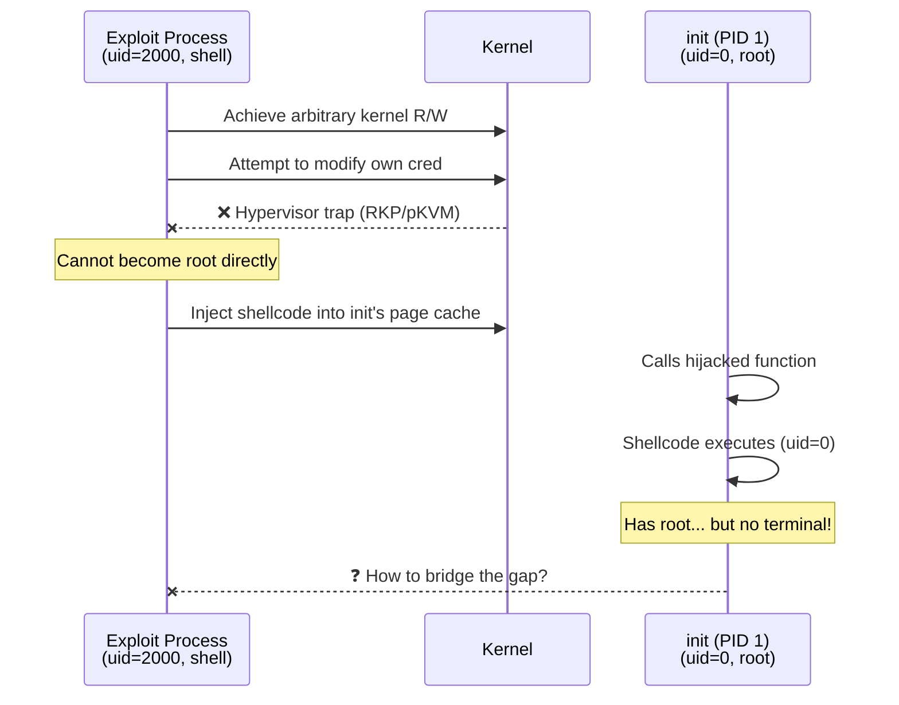
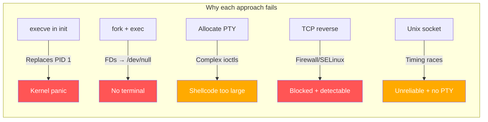
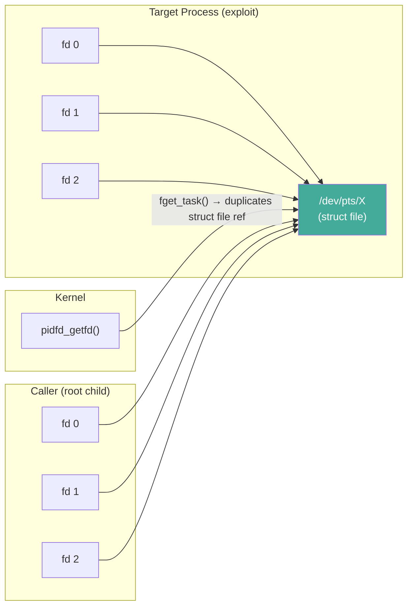
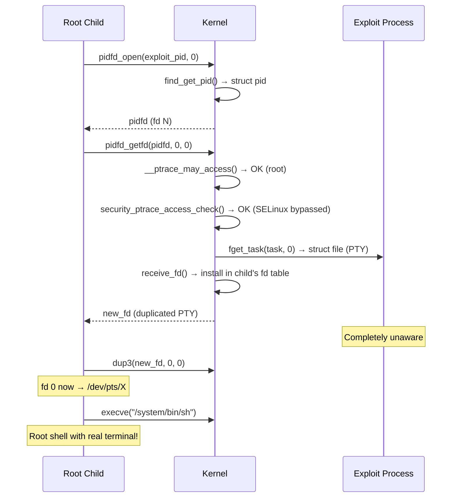
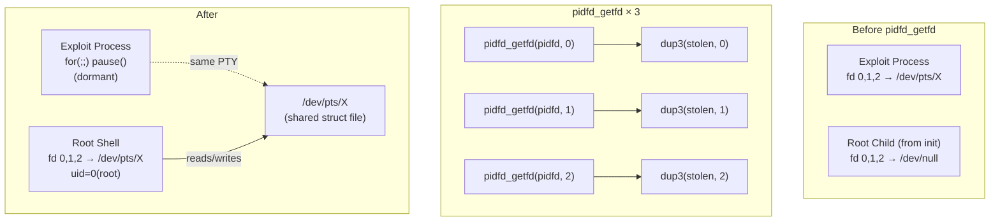
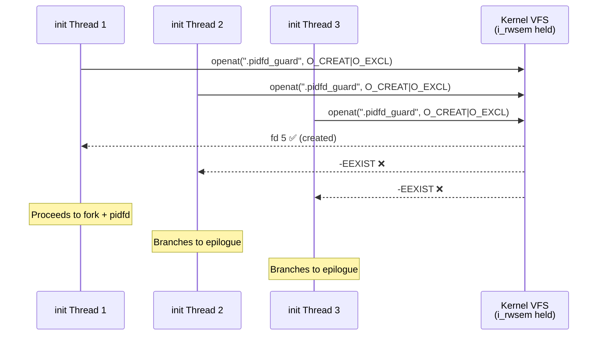
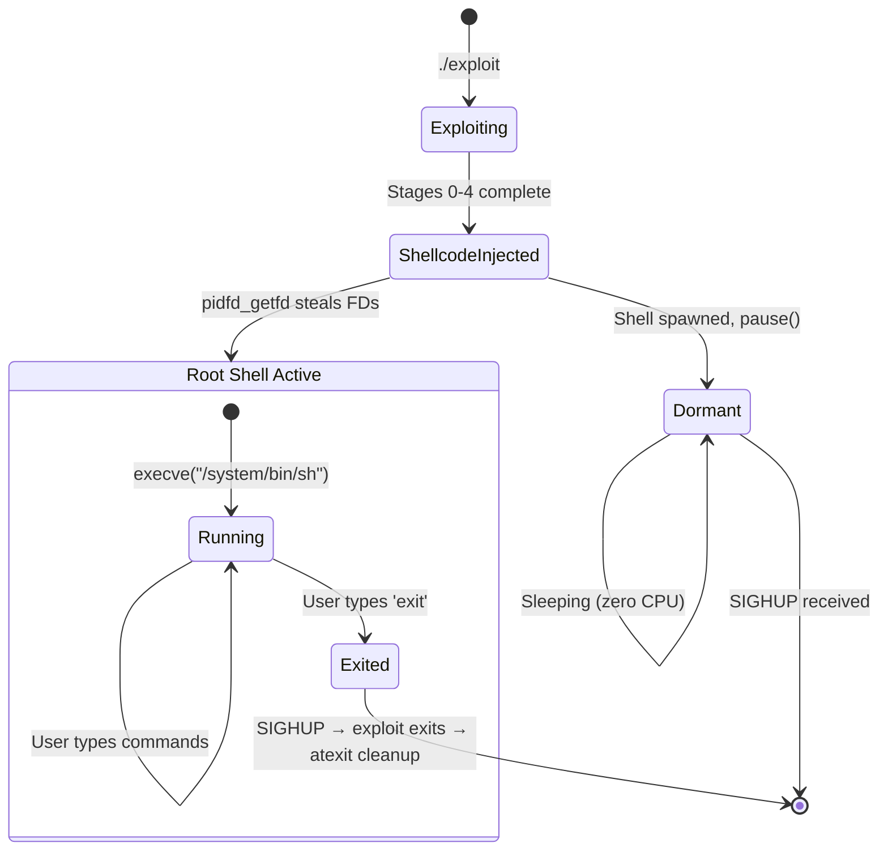
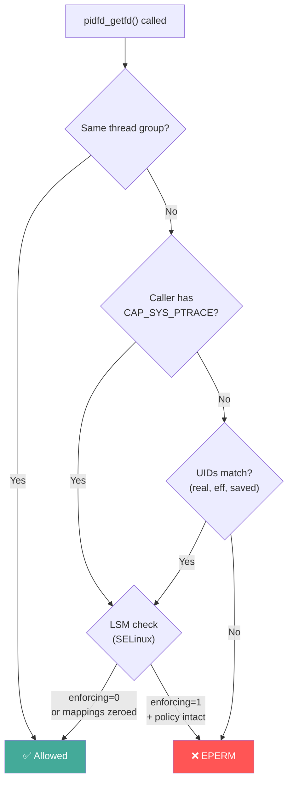

## Cross-Process FD Theft as a Privilege Escalation Delivery Mechanism


## Introduction

You've achieved arbitrary kernel read/write from userspace. You've bypassed SELinux. You can inject shellcode into any process on the system. Now what?

The final mile of a privilege escalation exploit — actually getting an interactive root shell back to you — is harder than it sounds on modern Android. Direct credential modification is blocked by hypervisor protections (RKP, pKVM, and similar). So the usual approach is: inject code into a privileged process (typically `init`, PID 1), fork a child, and somehow connect that child back to your terminal. That "somehow" is where most exploit authors reach for Unix domain sockets, reverse TCP shells, or helper binaries.

This post describes a cleaner technique: using Linux's `pidfd_open` and `pidfd_getfd` syscalls to **steal the exploit process's terminal file descriptors directly from shellcode**. No helper binaries, no network activity, full PTY semantics. One binary does everything.


## The Problem: Crossing the Process Boundary

In modern Android kernel exploitation, there's a recurring architectural problem. The process that *achieves* root execution is not the process that *needs* root execution.

Consider the typical exploit flow on a device with hypervisor-enforced credential protection:



The core problem: **you control code execution in a privileged process, but that process has no connection to your terminal**. Init's file descriptors point to `/dev/null` or `/dev/console`, not the pseudo-terminal (PTY) your ADB session is using.

This is the "last mile" problem. KASLR bypass, kernel R/W primitives, SELinux defeat: none of it matters if you can't bridge this gap.


## Why Simple Approaches Fail

So why not just use the obvious approaches? They all break in different ways.

### "Just exec a shell in init"

```c
// Shellcode injected into init
execve("/system/bin/sh", NULL, NULL);
```

This replaces init's process image with `sh`. The kernel immediately detects PID 1 is no longer performing init duties:

```
Kernel panic - not syncing: Attempted to kill init!
```

Init must never terminate or be replaced. Even `exit(0)` from init causes a kernel panic. Definitely not what we want.

### "Fork, then exec a shell"

```c
// Shellcode injected into init
if (clone(SIGCHLD, 0, 0, 0, 0) == 0) {
    // Child (uid=0)
    execve("/system/bin/sh", NULL, NULL);
}
```

The child inherits init's file descriptors. On Android:

```
init's FDs:
  fd 0 → /dev/null (or /dev/console)
  fd 1 → /dev/null
  fd 2 → /dev/null
```

The shell starts with no input source and no output destination. It's running as root, but completely disconnected from us. There's no terminal to type commands into.

### "Open a new PTY from shellcode"

Theoretically, the child could allocate a new pseudo-terminal:

```c
int master = open("/dev/ptmx", O_RDWR);
// grantpt(), unlockpt(), ptsname() ...
```

Problems:
- `grantpt()`, `unlockpt()`, `ptsname()` are libc functions, not syscalls. In raw shellcode, you'd have to replicate their underlying ioctls (`TIOCGPTN`, `TIOCSPTLCK`, `TIOCGPTPEER`).
- Even if you manage to allocate a PTY, the exploit process doesn't know which `/dev/pts/N` was created. You'd need an IPC channel to communicate this, which circles back to the socket problem.
- The shellcode size gets out of hand fast for constrained injection contexts (you often have a few hundred bytes to work with in page-cache injection).

### "Reverse shell over TCP"

```c
int s = socket(AF_INET, SOCK_STREAM, 0);
struct sockaddr_in addr = { .sin_family = AF_INET, .sin_port = htons(31337),
                            .sin_addr.s_addr = htonl(INADDR_LOOPBACK) };
connect(s, &addr, sizeof(addr));
dup2(s, 0); dup2(s, 1); dup2(s, 2);
execve("/system/bin/sh", NULL, NULL);
```

Issues:
- TCP/UDP connections pass through netfilter/iptables and SELinux network access controls (`connectto`, `tcp_socket`, `node_bind`). Even with enforcement disabled, iptables rules may block loopback from init's context.
- The connection is a byte stream, not a PTY. No terminal features (job control, signal handling, screen clearing, raw mode).
- Encoding `struct sockaddr_in` and the connection logic adds significant shellcode size.
- Leaves a listening socket on a well-known port. Easy to detect.

### "Unix domain socket + helper binary" (the traditional approach)

This is the most common technique in public exploits:

1. The exploit pushes a helper binary to the device
2. Shellcode in init `execve`s the helper
3. The helper creates a Unix domain socket, calls `accept()`
4. The exploit process `connect()`s to the socket
5. A `select()` loop relays I/O between the socket and the terminal

This works, but has reliability and quality problems:
- **Two binaries** must be built, pushed, and kept in sync
- **Socket timing races** between helper's `bind()/listen()` and exploit's `connect()`
- **Stale socket files** from crashed previous runs block re-execution
- **Not a real terminal**: the Unix socket is a byte stream, so `^C`, `^Z`, terminal resize, `vi`, `less`, `top` all break or behave incorrectly
- **SELinux socket permissions**: even with enforcement disabled, `unix_stream_socket` access vectors may still be checked depending on how completely the policy was neutralized




## Linux Process File Descriptors (pidfds)

Linux 5.3 (2019) introduced the `pidfd_open` system call, authored by Christian Brauner. The motivation was process management: traditional PID-based APIs suffer from inherent TOCTOU (time-of-check-to-time-of-use) race conditions because PIDs are recycled. A process could exit and a new process could reuse its PID between a `kill()` check and a `kill()` call.

A **pidfd** (process file descriptor) is a file descriptor that refers to a specific process. Unlike a PID integer, a pidfd maintains a kernel reference to the `struct pid`, preventing PID reuse ambiguity. The pidfd remains valid as long as the file descriptor is open, even if the process becomes a zombie.

```c
#include <sys/syscall.h>
#include <unistd.h>

// No glibc wrapper — use syscall() directly
int pidfd = syscall(SYS_pidfd_open, target_pid, 0);
// pidfd now refers to target_pid's struct pid
// Can be polled, signaled, or used with pidfd_getfd
```

### Syscall: `pidfd_open(2)`

```
int pidfd_open(pid_t pid, unsigned int flags);
```

- Added in Linux 5.3 (syscall 434 on arm64)
- Returns a file descriptor referring to the process, or -1 on error
- `flags`: 0 for now (`PIDFD_NONBLOCK` added in 5.10, `PIDFD_THREAD` in 6.9)
- Errors: `ESRCH` (no such process), `EINVAL` (bad flags), `EMFILE` (fd limit)

The returned file descriptor can be:
- **Polled** with `poll()`/`epoll()`: becomes readable when the process exits
- **Signaled** with `pidfd_send_signal()`: race-free signal delivery
- **Used with `pidfd_getfd()`**: duplicate a file descriptor from the target process
- **Used with `waitid(P_PIDFD, ...)`**: race-free child reaping

For exploitation, `pidfd_getfd` is the interesting one.


## pidfd_getfd: Cross-Process FD Duplication

Linux 5.6 (2020) added `pidfd_getfd`, completing the pidfd API for our purposes:

```
int pidfd_getfd(int pidfd, int targetfd, unsigned int flags);
```

- Added in Linux 5.6 (syscall 438 on arm64)
- Returns a new fd in the calling process that duplicates `targetfd` from the target, or -1 on error
- `pidfd`: obtained from `pidfd_open()` (or `clone()` with `CLONE_PIDFD`)
- `targetfd`: the fd number to steal from the target
- `flags`: must be 0

The returned file descriptor is a **kernel-level duplicate**: it references the same underlying `struct file` as the target's fd. So:

- If the target has fd 0 pointing to `/dev/pts/3`, you get a new fd also pointing to `/dev/pts/3`
- Both processes can independently read/write through their respective fds
- The `struct file` reference count is incremented, so the file stays open even if the target closes its copy
- The new fd is created with `O_CLOEXEC` set

This is functionally equivalent to `SCM_RIGHTS` file descriptor passing over Unix domain sockets, but **without requiring the target's cooperation**. The target process doesn't need to call `sendmsg()` or even know it's happening.



### Permission Model

`pidfd_getfd` performs a `PTRACE_MODE_ATTACH_REALCREDS` check. This is the same permission check that `ptrace(PTRACE_ATTACH)` uses. The kernel evaluates:

1. **Same-user check** — is the caller's real UID equal to the target's real, effective, and saved-set UIDs? (same for GIDs)
2. **Capability check** — does the caller have `CAP_SYS_PTRACE` in the target's user namespace?
3. **LSM check** — does SELinux/Yama allow `process:ptrace`?

The bottom line: **root can ptrace anyone**. If our shellcode runs as uid=0 (forked from init), it passes the capability check. The SELinux check is the only remaining gate, and if we've already disabled enforcement or zeroed policy mappings, that passes too.


## The Kernel Implementation

Digging into the kernel source helps reason about edge cases. The implementation lives in `kernel/pid.c` (or `fs/file.c` depending on kernel version):

### pidfd_open internals

```c
SYSCALL_DEFINE2(pidfd_open, pid_t, pid, unsigned int, flags)
{
    // Validate flags
    // Find struct pid for the given pid number
    struct pid *p = find_get_pid(pid);
    // Allocate a new file descriptor
    // Create a pidfd file (backed by pidfd_fops)
    // Install into the calling process's fd table
    // Return the fd number
}
```

The pidfd is backed by an anonymous inode with `pidfd_fops`. It holds a reference to `struct pid`, which is a stable kernel object that outlives process exit (it persists until all references, including pidfds, are dropped).

### pidfd_getfd internals

```c
SYSCALL_DEFINE3(pidfd_getfd, int, pidfd, int, fd, unsigned int, flags)
{
    // 1. Look up the struct pid from the pidfd
    struct pid *pid = pidfd_pid(pidfd_file);

    // 2. Get the task_struct
    struct task_struct *task = get_pid_task(pid, PIDTYPE_TGID);

    // 3. Permission check — this is the critical gate
    int ret = security_ptrace_access_check(task, PTRACE_MODE_ATTACH_REALCREDS);
    if (ret) return ret;

    // 4. Look up the target's fd table
    struct file *file = fget_task(task, fd);  // increments f_count

    // 5. Install into our fd table
    int newfd = receive_fd(file, O_CLOEXEC);

    return newfd;
}
```

A few things worth noting here:

`fget_task()` reads the target's `files_struct` under RCU protection and bumps the `struct file` reference count. Safe even if the target is concurrently closing fds.

`receive_fd()` allocates a new fd in the caller's table and installs the `struct file`. The new fd always gets `O_CLOEXEC`.

The refcount bump is important: it means the file (the PTY, in our case) stays open even if the target process closes its copy or exits. The exploit can die after the shell steals its fds, and the shell's fds remain valid.

And the target process has no idea any of this happened. No `SIGTRAP`, no audit event (beyond SELinux), no `/proc` notification. Completely invisible.




## Applying pidfd to Exploit Shellcode

The technique for post-exploitation is:

The exploit process (unprivileged, holding a PTY from adb) patches its own PID into the shellcode data before injecting it into the page cache. When the shellcode fires inside init, it forks a child. That child (running as uid=0) calls `pidfd_open(exploit_pid)` to get a handle to the exploit process, then `pidfd_getfd` three times to duplicate fds 0, 1, and 2 — all pointing to the PTY. It installs them via `dup3()` and calls `execve("/system/bin/sh")`. Meanwhile, the exploit process goes dormant. The shell now owns the real PTY and drives the terminal.




## The Concurrency Problem: Atomic Guard Files

There's a subtlety when injecting shellcode into a multi-threaded process like `init`. Android's init runs multiple threads, and the hijacked function (`__system_property_find` in the libc page-cache injection scenario) is called frequently by many threads simultaneously.

If two threads hit the shellcode at the same time, both would try to fork children. You'd get duplicate root shells racing for the terminal, zombie processes, and potentially init instability.

### The TOCTOU trap

A naive guard using `faccessat()`:

```asm
// BAD: TOCTOU race
mov x8, #48           // __NR_faccessat
svc #0                // check if guard file exists
cbz x0, .done        // if exists, skip
// ... fork + exec ...
```

Between the `faccessat` check and the subsequent operation, another thread could pass the same check. This is a classic TOCTOU (time-of-check-to-time-of-use) race condition.

### The atomic solution: O_CREAT | O_EXCL

The `openat()` syscall with `O_CREAT | O_EXCL` flags provides an atomic test-and-set operation:

```asm
mov x0, #-100         // AT_FDCWD
adr x1, guard_path    // "/data/local/tmp/.pidfd_guard"
movz x2, #0xC1        // O_WRONLY | O_CREAT | O_EXCL
movz x3, #0x1A4       // 0644
mov x8, #56           // __NR_openat
svc #0
tbnz x0, #63, .done   // if negative (EEXIST), already ran
```

`O_EXCL` instructs the kernel to fail with `EEXIST` if the file already exists. The file creation and existence check happen atomically within the VFS layer, specifically in `lookup_open()` → `vfs_create()`, which holds the parent directory's `i_rwsem`. No matter how many threads execute this simultaneously, exactly one will succeed in creating the file. All others get `-EEXIST` and branch to the epilogue.

Same trick as lock files and PID files. Atomic mutual exclusion via the filesystem.



### Flag encoding on arm64 Android

The `O_*` flag values are architecture-specific. On arm64 Android (bionic libc, Linux kernel):

| Flag | Value |
|---|---|
| `O_WRONLY` | 0x001 |
| `O_CREAT` | 0x040 |
| `O_EXCL` | 0x080 |
| Combined | 0x0C1 |

These can be verified on-device:

```bash
adb shell "grep -E 'O_CREAT|O_EXCL|O_WRONLY' /usr/include/asm-generic/fcntl.h"
```

Or from the kernel headers:

```c
// include/uapi/asm-generic/fcntl.h
#define O_WRONLY    00000001
#define O_CREAT     00000100  // octal → 0x40
#define O_EXCL      00000200  // octal → 0x80
```


## Shellcode Architecture

The complete shellcode for the pidfd approach fits in 356 bytes (76 ARM64 instructions + 52 bytes of data). Here's the logical structure:

```
┌──────────────────────────────────────┐  offset 0x00
│ PROLOGUE (4 insns, 16B)              │
│   Save x29, x30, x0, x1, x2, x8      │
├──────────────────────────────────────┤  offset 0x10
│ PID CHECK (3 insns, 12B)             │
│   getpid() → if not PID 1, skip      │
├──────────────────────────────────────┤  offset 0x1C
│ ATOMIC GUARD (7 insns, 28B)          │
│   openat(O_CREAT|O_EXCL)             │
│   if EEXIST → skip                   │
│   close(guard_fd)                    │
├──────────────────────────────────────┤  offset 0x38
│ FORK (6 insns, 24B)                  │
│   clone(SIGCHLD)                     │
│   parent → skip to epilogue          │
├──────────────────────────────────────┤  offset 0x50
│ CHILD SETUP (39 insns, 156B)         │
│   setsid()                           │
│   pidfd = pidfd_open(exploit_pid)    │
│   fd0 = pidfd_getfd(pidfd, 0)        │
│   dup3(fd0, 0)                       │
│   fd1 = pidfd_getfd(pidfd, 1)        │
│   dup3(fd1, 1)                       │
│   fd2 = pidfd_getfd(pidfd, 2)        │
│   dup3(fd2, 2)                       │
│   close(pidfd)                       │
│   execve("/system/bin/sh")           │
│   exit(1)  // fallback               │
├──────────────────────────────────────┤  offset 0x10C
│ EPILOGUE (5 insns, 20B)              │
│   Restore x2, x8, x0, x1, x29, x30   │
│   Execute replaced instruction       │
│   Branch back to original code       │
├──────────────────────────────────────┤  offset 0x130
│ DATA (52 bytes)                      │
│   guard_path: "/data/local/.."  32B  │
│   exploit_pid: <patched>         4B  │
│   padding:                      12B  │
│   sh_path: "/system/bin/sh"     16B  │
└──────────────────────────────────────┘  offset 0x164
                                   Total: 356 bytes
```

### Key design decisions

**1. Register preservation.** The shellcode is injected into a normal function (`__system_property_find`). It must preserve all caller-saved registers and the stack pointer. The prologue saves x29, x30, x0, x1, x2, x8 to the stack; the epilogue restores them. The parent path (init threads that trigger the shellcode but aren't the chosen child) returns to the original function with all registers intact.

**2. setsid().** The child calls `setsid()` to create a new session. Without this, the child would remain in init's session and process group. Signals sent to init's process group (e.g., by the kernel's init recovery mechanisms) would also hit the shell.

**3. Data section via PC-relative addressing.** All string data (guard path, shell path) and the exploit PID are stored after the code and accessed with `adr` (PC-relative address load). This avoids any writes to the code page, which is critical because the target process maps the injected page as `r-xp` (read+execute, no write). Any store instruction targeting the code page would trigger a data abort in the target process.

**4. PID patching at injection time.** The exploit process's PID is a runtime value. It's stored in the shellcode data section and patched by the exploit before injection:

```c
sc_data[SC_PID_DATA_IDX] = (uint32_t)getpid();
```

The shellcode loads it with:
```asm
adr  x9, exploit_pid    // PC-relative load of data address
ldr  w0, [x9]           // load the 32-bit PID value
```

**5. The back-branch.** After the epilogue restores registers and executes the replaced instruction (`mov x1, x0`), the shellcode branches back to the original code at the instruction after the trampoline. This branch is a PC-relative `B` instruction with a negative offset. The encoding is computed at shellcode design time based on the known page layout.


## The Dormant Exploit Pattern

After shellcode injection and triggering, the exploit process has to stay alive but do nothing.

```c
// Post-exploit: shell has our FDs, let it drive the terminal
for (;;) pause();
```

Why? Three reasons.

**FD lifetime.** The shell's file descriptors are kernel-level duplicates of the exploit's fds — same `struct file` underneath. The refcount keeps the PTY alive even if the exploit closes its copies, but staying dormant is simpler.

**Terminal ownership.** If the exploit kept running and tried to read stdin, it would race with the shell for input. `pause()` blocks until a signal arrives, yielding the terminal entirely.

**Clean exit.** When the user types `exit`, the PTY slave side closes. The kernel sends `SIGHUP` to the exploit (it's the session leader), which kills it. The `atexit()` handlers fire, cleaning up dirty page table PTEs so the kernel doesn't panic.



This "dormant parent" pattern is the pidfd equivalent of a `wait()` call, but without parent-child relationship semantics (the shell is init's grandchild, not the exploit's child).


## Permission Model and SELinux Interaction

The pidfd approach has specific permission requirements that must be satisfied:

### Capability check

`pidfd_getfd` requires `PTRACE_MODE_ATTACH_REALCREDS`. The kernel function `__ptrace_may_access()` checks:

```c
// Simplified from kernel/ptrace.c
static int __ptrace_may_access(struct task_struct *task, unsigned int mode)
{
    // Check if same thread group → always allowed
    // Check real UIDs/GIDs match
    // Check CAP_SYS_PTRACE capability
    // Call security_ptrace_access_check() → LSM hook
}
```

Our child runs as uid=0 (forked from init). Root has `CAP_SYS_PTRACE` implicitly. The UID check passes because root can ptrace any process.

### SELinux check

The LSM hook `security_ptrace_access_check()` calls into SELinux's `selinux_ptrace_access_check()`, which checks the `process:ptrace` access vector. This is where exploitation becomes architecture-dependent:

**If you disabled SELinux by flipping `enforcing` to 0:**
The check calls `avc_has_perm()`, which internally calls `enforcing_enabled()`. In permissive mode, a denial is logged but not enforced, so the syscall succeeds.

**If you zeroed the security class mappings:**
The `process` security class maps to an internal class ID. With all mapping values zeroed, the permission lookup finds no defined permissions for the `process` class. The `allow_unknown` flag (if set) causes undefined permissions to be allowed.

**If you did both** (which is what we do, just to be safe):
The pidfd_getfd succeeds regardless of which SELinux bypass technique is effective on the specific device.

### Yama LSM

Some kernels enable the Yama LSM, which restricts ptrace even between same-user processes. Check `/proc/sys/kernel/yama/ptrace_scope`:

| Value | Meaning | Impact on pidfd_getfd |
|---|---|---|
| 0 | Classic ptrace permissions | Root → any process: allowed |
| 1 | Restricted to descendants | Root → any process: allowed (CAP_SYS_PTRACE overrides) |
| 2 | Admin-only | Root: allowed |
| 3 | No ptrace at all | **Would block pidfd_getfd**, but can be overridden with kernel R/W |

On Android, Yama is typically not enabled, or is set to 0 or 1. Root with CAP_SYS_PTRACE bypasses Yama scope 0-2.




## Comparison with Alternative Approaches

| Criterion | Unix socket + helper | TCP reverse shell | PTY alloc in shellcode | pidfd_getfd |
|---|---|---|---|---|
| Files required | 2 (exploit + helper) | 1 | 1 | **1** |
| Network activity | None | Loopback TCP | None | **None** |
| Terminal type | Byte stream | Byte stream | Real PTY (complex) | **Real PTY** |
| Job control (^C, ^Z) | ❌ | ❌ | ✅ | **✅** |
| Terminal apps (vi, top) | ❌ | ❌ | ✅ | **✅** |
| SIGWINCH (resize) | Manual relay | ❌ | ✅ | **✅** |
| Connection reliability | Socket race conditions | Firewall/SELinux blocks | N/A | **Direct (no connection)** |
| Shellcode size | ~144B + helper binary | ~200B | ~400B+ | **~356B** |
| Cleanup required | Socket file + result file | Port release | PTY pairs | **Guard file** |
| Detection surface | Socket in /data/ | Listening port | /dev/ptmx access | **Guard file in /data/** |
| Minimum kernel | Any | Any | Any | **5.6+** |

The main limitation is the kernel version requirement (5.6+). Android 12+ devices all ship with kernel 5.10+ (GKI mandate), so it's available on all of them. For older devices running kernel 4.x, you'd need a different approach.

### Kernel version availability

| Android version | Minimum kernel | pidfd_open | pidfd_getfd |
|---|---|---|---|
| Android 11 | 4.19 / 5.4 | ✅ (5.4 only) | ❌ / ⚠️ (backport varies) |
| Android 12 | 5.10 | ✅ | ✅ |
| Android 13 | 5.10 / 5.15 | ✅ | ✅ |
| Android 14 | 5.15 / 6.1 | ✅ | ✅ |
| Android 15 | 6.1 / 6.6 | ✅ | ✅ |

For Android 12+ devices, pidfd_getfd is a safe choice.


## Limitations and Caveats

### 1. Exploit process must stay alive

The exploit process must remain running while the shell is active. If it exits or crashes, the shell's PTY may become invalid (though technically the kernel refcount keeps the `struct file` alive, the PTY session mechanics may deliver SIGHUP).

The `for(;;) pause()` pattern works well here. The process consumes zero CPU and barely any memory.

### 2. Guard file ownership

The guard file is created by init (uid=0). On `/data/local/tmp` (which has the sticky bit set), unprivileged users cannot delete root-owned files. This means:

```bash
# After a successful exploit run, re-running may fail
# because the guard file still exists
$ rm /data/local/tmp/.pidfd_guard
rm: /data/local/tmp/.pidfd_guard: Operation not permitted

# Solutions:
$ su -c rm /data/local/tmp/.pidfd_guard  # if you still have root
# OR
$ reboot                                  # device reboot clears tmpfs
```

The exploit should attempt `unlink()` at startup (best-effort), but this will only succeed if the file was created by the same user.

### 3. PID reuse race

There's a theoretical race: between the exploit patching its PID into the shellcode and the shellcode executing `pidfd_open(exploit_pid)`, the exploit could crash and the PID could be reused. The child would then steal fds from an unrelated process.

This race window is tiny in practice:
- The exploit goes dormant immediately after injection
- PID reuse requires the process to exit AND a new process to claim the same PID
- The shellcode triggers within milliseconds to seconds of injection
- Using `pidfd_open` (which references `struct pid`) instead of raw PIDs means even zombie state is handled correctly

### 4. Multiple exploit instances

If two exploit instances run simultaneously, they'd race for the guard file (only one would win) and potentially corrupt each other's page cache modifications. This isn't pidfd-specific; it's a general page-cache injection concern. Serial execution is assumed.

### 5. aarch64-specific shellcode

The shellcode encodings (branch offsets, instruction sequences, syscall numbers) are aarch64-specific. Porting to x86_64 or arm32 means re-encoding everything and double-checking syscall numbers. The technique itself works on any architecture.


## Conclusion

`pidfd_open` + `pidfd_getfd` turns out to be a near-perfect fit for page-cache injection exploits on Android. No helper binary, no sockets, no network activity — just steal the exploit's terminal fds and exec a shell. Root running in init can grab any process's file descriptors thanks to ptrace permission asymmetry, and the result is a real PTY session with job control, tab completion, the works. If you're targeting Android 12+ (kernel 5.10+), this is probably what you want.


## References

1. **pidfd_open(2) man page** — [man7.org/linux/man-pages/man2/pidfd_open.2.html](https://man7.org/linux/man-pages/man2/pidfd_open.2.html)
2. **pidfd_getfd(2) man page** — [man7.org/linux/man-pages/man2/pidfd_getfd.2.html](https://man7.org/linux/man-pages/man2/pidfd_getfd.2.html)
3. **"Grabbing file descriptors with pidfd_getfd()"** — Jonathan Corbet, LWN.net, January 2020 — [lwn.net/Articles/808997/](https://lwn.net/Articles/808997/)
4. **"Completing the pidfd API"** — Christian Brauner, LWN.net, 2019 — [lwn.net/Articles/800379/](https://lwn.net/Articles/800379/)
5. **Linux kernel source: pidfd_getfd implementation** — [github.com/torvalds/linux](https://github.com/torvalds/linux) (`kernel/pid.c`, `fs/file.c`)
6. **Pidfd timeline and history** — Nick Black, dankwiki — [nick-black.com/dankwiki/index.php/Pidfd](https://nick-black.com/dankwiki/index.php/Pidfd)
7. **ptrace(2) — PTRACE_MODE_ATTACH_REALCREDS** — [man7.org/linux/man-pages/man2/ptrace.2.html](https://man7.org/linux/man-pages/man2/ptrace.2.html)
8. **Linux kernel selftests: pidfd_getfd_test.c** — [android.googlesource.com/kernel/common](https://android.googlesource.com/kernel/common/+/refs/heads/android-mainline/tools/testing/selftests/pidfd/pidfd_getfd_test.c)
9. **POSIX.1-2017 `open(2)` specification** — O_CREAT | O_EXCL atomicity guarantees: "If O_EXCL and O_CREAT are set, open() shall fail if the file exists."

— locus-x64